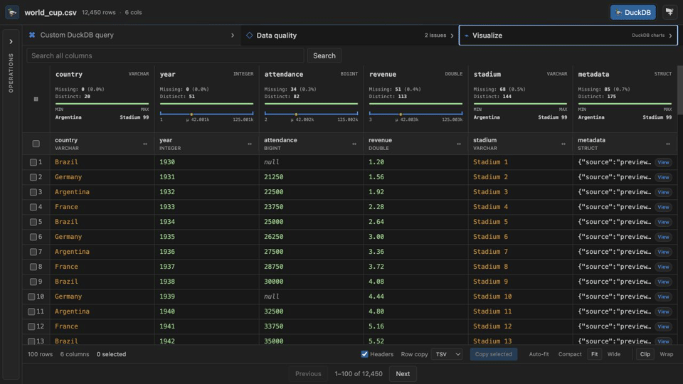
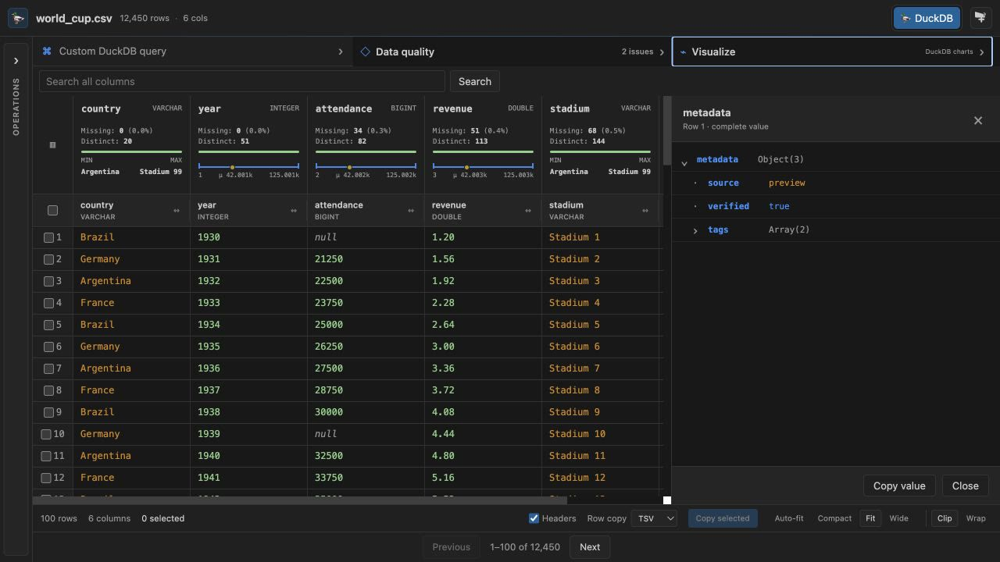

# QuackWrangler

[](https://github.com/mohsinsurani/quackwrangler/actions/workflows/ci.yml)
[](https://marketplace.visualstudio.com/items?itemName=quackwrangler.quackwrangler)
[](https://marketplace.visualstudio.com/items?itemName=quackwrangler.quackwrangler)
[](LICENSE)
[](https://code.visualstudio.com/)

**Open, understand, transform, visualize, and export data without leaving VS Code. Your file contents are processed locally and never uploaded.**

QuackWrangler does not send rows or cell values to external servers. The optional AI transform planner is the only network-backed analysis feature: when explicitly invoked, it sends your instruction and schema metadata (column names, types, and nullability)—never row data—to OpenAI after showing its privacy behavior.

QuackWrangler ships with DuckDB built in. Open CSV, Parquet, JSON, Excel, and ODS files directly—no Python environment, Jupyter kernel, or database setup required.

> QuackWrangler is an independent open-source project inspired by the visual workflow of data-wrangling tools. It is not affiliated with or endorsed by Microsoft.

> **Development status:** this README documents the upcoming `0.1.2` source tree. The latest published Marketplace release remains `0.1.1`. Version `0.1.2` will not be packaged or published until the maintainer explicitly approves the release.

**Install:** `code --install-extension quackwrangler.quackwrangler`

<figure>



<figcaption>Open world_cup.csv → inspect column profiles → browse nested structs → visualize correlations — all without leaving VS Code.</figcaption>

</figure>



## Fast workflows

- **Quick filter:** right-click a table cell to keep its value, exclude it, find matching text, or show nulls. The result is a normal undoable transform.
- **Formula Builder:** open **Transform → Formula Builder** to create conditional columns, date differences, regex extractions, or combined text without SQL.
- **Join or append files:** open **Combine Files**, choose another supported file, then configure a join or append rows by matching column names.
- **Save an analysis:** run **QuackWrangler: Save Workspace** from the Command Palette to create a portable `.qw` file. Use **QuackWrangler: Open Workspace** to restore its source and transform history.
- **Recent files:** the QuackWrangler activity-bar view keeps the ten most recently opened data files.
- **Work with nested data:** select a struct, list, map, or JSON cell to browse it as a tree, copy a JSON Pointer, extract a field, flatten an object, or explode an array into rows.
- **Open cloud data:** run **QuackWrangler: Open Remote HTTPS/S3 Data** to query a supported remote file through DuckDB `httpfs`.
- **Visible remote loading:** HTTPS/S3 opens show staged progress and surface actionable connection, authentication, and format errors in the editor.
- **Generate a cleaning plan:** configure an OpenAI key in VS Code SecretStorage, then run **Generate Visual Transforms with AI**. Only column names/types/nullability and your instruction are sent; generated steps require approval and pass the normal transform validator.
- **Compare schemas:** select multiple files with **Compare File Schemas**, or recursively inspect up to 100 files with **Detect Folder Schema Drift**.

## Why QuackWrangler?

| Workflow                    | QuackWrangler      | Typical file viewer | Python notebook workflow |
| --------------------------- | ------------------ | ------------------- | ------------------------ |
| Open local data immediately | Built-in DuckDB    | Usually             | Environment dependent    |
| Visual transformations      | Yes                | Usually read-only   | Code required            |
| Column profiles and charts  | Yes                | Limited             | Code required            |
| Custom analytical queries   | DuckDB SQL         | Rare                | Yes                      |
| Python or kernel required   | **No**             | No                  | **Yes**                  |
| Export transformed results  | Parquet, CSV, JSON | Limited             | Code required            |

QuackWrangler is designed for the space between a basic read-only preview and a full notebook: fast enough for large files, approachable without code, and powerful enough for reproducible analytical work.

## Performance benchmark

On a deterministic one-million-row Parquet workload, QuackWrangler's production Node DuckDB engine completed the analytical transform faster than both comparison engines. Polars loaded the file faster and had the lowest end-to-end time; QuackWrangler finished the complete workflow about 2× faster than Pandas.

| Engine                           | Load Parquet | Filter + aggregate + sort |        Total |
| -------------------------------- | -----------: | ------------------------: | -----------: |
| QuackWrangler (DuckDB 1.5.4-r.1) |     16.07 ms |               **6.89 ms** |     22.35 ms |
| Polars 1.43.1                    |  **2.75 ms** |                   8.56 ms | **11.31 ms** |
| Pandas 3.0.5                     |      8.89 ms |                  35.09 ms |     43.66 ms |

These are medians of seven measured runs after two warmups on an Apple M3 Pro with 18 GB RAM, recorded August 1, 2026. Every engine ran equivalent eager operations and returned the same validated 20-row result. Lower is better.

### Scaling and peak memory

Fresh-process measurements include each language runtime and its loaded libraries:

| Rows | QuackWrangler time / RSS |     Polars time / RSS |    Pandas time / RSS |
| ---: | -----------------------: | --------------------: | -------------------: |
|  10K |          4.61 ms / 91 MB |  **3.20 ms** / 134 MB |    34.24 ms / 126 MB |
| 100K |    19.73 ms / **101 MB** |  **5.16 ms** / 147 MB |    38.83 ms / 143 MB |
|   1M |    22.88 ms / **166 MB** | **15.82 ms** / 309 MB |    84.87 ms / 330 MB |
|  10M |   **147.63 ms / 741 MB** |  242.48 ms / 1,693 MB | 572.01 ms / 1,877 MB |

At 10 million rows, QuackWrangler was 1.6× faster than Polars and 3.9× faster than Pandas in this workload, while its measured peak process RSS was 56% lower than Polars and 61% lower than Pandas. All engines completed successfully; no unmeasured OOM claim is made. See the [raw scalability results](benchmarks/results/scalability.json).

```text
10M rows — total workflow time (lower is better)

QuackWrangler  148 ms  ███████
Polars         242 ms  ████████████
Pandas         572 ms  █████████████████████████████
```

An exploratory single 50M-row run also completed for every engine:

| Engine        |      Total | Peak process RSS |
| ------------- | ---------: | ---------------: |
| QuackWrangler | **1.18 s** |      **2.29 GB** |
| Polars        |     2.73 s |          3.82 GB |
| Pandas        |     4.54 s |          4.92 GB |

This 50M result is one fresh-process sample rather than a multi-run median. System swap usage increased during the experiment, so it is published as exploratory evidence and not used for an OOM or “under 1 GB” claim. See the [raw 50M result](benchmarks/results/scalability-50m.json).

### File-format loading

For the same generated 100K-row dataset, DuckDB materialized Parquet in 13.98 ms, NDJSON in 50.62 ms, and CSV in 63.49 ms. Parquet was 4.5× faster to load than CSV and produced a much smaller file. See the [raw format results](benchmarks/results/formats.json).

This is a reproducible workload, not a universal engine ranking; results depend on hardware, versions, data shape, cache state, swap pressure, and query. Peak RSS is more defensible than an allocator delta but still includes different runtime overheads. Large runs remain opt-in because they can materially affect workstation responsiveness.

See the [benchmark methodology and run instructions](benchmarks/README.md) and [raw machine-readable result](benchmarks/results/latest.json). Re-run it locally with:

```bash
npm run benchmark
npm run benchmark:all # primary, scalability, and format suites
```

## Highlights

- DuckDB-native execution with automatic disk spilling
- **No Python, Jupyter, or database setup required** — works immediately
- Local-first privacy: file contents, rows, and cell values are processed on your machine and are never sent to external servers
- Virtualized grid with synchronized headers and consistent column sizing
- Professional column profiles with completeness, cardinality, ranges, percentiles, and distributions
- Inline histogram, bar, scatter, line, box-plot, and correlation-heatmap charts backed by full DuckDB queries
- Data-quality summary for nulls, duplicates, and potential IQR outliers
- Expandable nested-data tree for structs, lists, maps, and JSON values, with JSON Pointer copying and extract/flatten/explode transforms
- Parquet, CSV, TSV, JSON, JSONL/NDJSON, XLSX, and ODS viewing
- Filters, sorting, deduplication, column rename/drop/add/cast, null filling, and grouping/aggregation
- Full-dataset search across every column (`Cmd/Ctrl+F`)
- Pivot and unpivot reshaping
- Drag-and-drop transformation ordering
- Custom read-only DuckDB SQL with results shown in the grid
- Multi-row selection and spreadsheet-friendly TSV, CSV, pipe, or JSON copying
- Full transformed-data export to Parquet, CSV, or JSON
- Undo and redo for the transformation pipeline
- Visual IF/date/regex/text formula builder
- Multi-file joins and union-by-name
- Shareable `.qw` workspaces and recent-file shortcuts
- HTTPS/S3 sources, schema comparison/drift reports, and opt-in schema-only AI transform plans

The current architecture is intentionally DuckDB-only. Polars may be reconsidered for a future major version after packaging, transport, and feature-parity requirements are designed.

## Install

### From the VS Code Marketplace

Open Extensions in VS Code, search for **QuackWrangler**, and select **Install**. You can also open the [Marketplace listing](https://marketplace.visualstudio.com/items?itemName=quackwrangler.quackwrangler). The command-line equivalent is:

```bash
code --install-extension quackwrangler.quackwrangler
```

### From a local VSIX

```bash
git clone https://github.com/mohsinsurani/quackwrangler.git
cd quackwrangler
npm ci
npm --prefix webview-ui ci
npm run package
code --install-extension quackwrangler-<version>.vsix
```

Alternatively, run **Extensions: Install from VSIX...** from the VS Code Command Palette and select the generated file.

## Use QuackWrangler

1. Open QuackWrangler from the Activity Bar.
2. Choose **Open data file** for one file, or **Open data folder** to scan a directory.
3. The folder view preserves subdirectories, hides unsupported files and empty folders, and opens a data file when selected.
4. You can also right-click a supported file in Explorer and choose **Open in QuackWrangler**.
5. CSV, TSV, Parquet, JSONL/NDJSON, XLSX, and ODS files open directly in QuackWrangler when it is their default editor. Use **Open With... → Configure default editor** to change an existing VS Code file association.
6. Inspect column profiles and values in the synchronized data grid.
7. Select an operation in the left panel, enter its parameters, and apply it.
8. Use **Custom DuckDB query** to run one read-only `SELECT`, `WITH`, or `VALUES` statement.
9. Export the complete transformed dataset, or select rows and copy them as TSV, CSV, pipe-separated text, or JSON.

Custom queries run against `current_data`:

```sql
SELECT country, COUNT(*) AS matches
FROM current_data
WHERE year >= 2000
GROUP BY country
ORDER BY matches DESC;
```

Mutation statements are rejected because the query box is an exploration surface, not an unrestricted database console.

## Filters and transforms

Filters support equality and inequality, `>`, `>=`, `<`, `<=`, contains, does not contain, starts with, ends with, `IN`, `NOT IN`, null checks, and range checks. Values are safely converted for numeric, boolean, date/time, and text columns.

Other operations include:

| Category        | Operations                                                                                    |
| --------------- | --------------------------------------------------------------------------------------------- |
| Filter          | Typed filters, cell quick filters, search, remove duplicates                                  |
| Transform       | Add, formula-build, rename, drop, cast, fill nulls, and extract/flatten/explode nested values |
| Arrange         | Header sorting or explicit ascending/descending sort                                          |
| Aggregate       | Group and aggregate, pivot, and unpivot                                                       |
| Combine files   | Left/inner/right/full join and union-by-name                                                  |
| Explore         | Type-aware profiles, data-quality findings, charts, nested-value inspector, read-only SQL     |
| Export and copy | Parquet, CSV, JSON, clipboard formats, selected rows                                          |

QuackWrangler only offers numeric aggregations such as average for compatible scalar columns. Nested JSON values remain inspectable without being sent to invalid DuckDB aggregate functions. Click a nested cell to open its tree. Node actions can copy an RFC 6901-style JSON Pointer, extract the selected value as a column, flatten a selected object, or explode a selected array into rows. These actions become ordinary pipeline steps, so they support undo, redo, reordering, and `.qw` workspace persistence.

## Supported file formats

| Format         | Extensions                   | Notes                                                |
| -------------- | ---------------------------- | ---------------------------------------------------- |
| Parquet        | `.parquet`                   | Native DuckDB reader                                 |
| Delimited text | `.csv`, `.tsv`               | Automatic schema and delimiter detection             |
| JSON           | `.json`, `.jsonl`, `.ndjson` | Arrays, records, and nested values supported         |
| Excel          | `.xlsx`                      | Uses DuckDB's spreadsheet support                    |
| OpenDocument   | `.ods`                       | Uses DuckDB's spreadsheet support                    |
| Arrow IPC      | `.arrow`, `.arrows`, `.ipc`  | Uses DuckDB's signed `nanoarrow` community extension |

HTTPS and S3 URLs are supported for formats handled by the corresponding DuckDB reader. Remote access uses DuckDB `httpfs`; private S3 authentication follows DuckDB/AWS credential-chain configuration, so QuackWrangler does not place cloud credentials in workspace files.

ORC files are detected and produce an actionable compatibility message, but they are not advertised as readable: the embedded DuckDB 1.5 runtime does not currently expose a supported ORC reader. Convert ORC to Parquet or CSV before opening it. QuackWrangler will enable native ORC loading only when a supported, testable DuckDB reader is available.

Spreadsheet support can require DuckDB to download an extension the first time it is used. Legacy `.xls` files are not currently supported.

## AI privacy and configuration

AI transform generation is disabled until you explicitly store an OpenAI API key using **QuackWrangler: Configure OpenAI API Key**. The key is kept in VS Code SecretStorage, never settings or `.qw` files. Requests contain your instruction and schema metadata only—no cell values or sampled rows. The proposed plan is shown for approval, cannot contain raw SQL, and is limited to the same validated operations available in the visual UI. Configure `quackwrangler.ai.model` to choose the model; the default is `gpt-5.6-luna`.

## Settings

Open VS Code Settings and search for `QuackWrangler`, or configure values directly:

```json
{
  "quackwrangler.duckdb.memoryLimit": "1GB",
  "quackwrangler.duckdb.tempDirectory": "",
  "quackwrangler.duckdb.maxTempDirectorySize": "15GB",
  "quackwrangler.display.pageSize": 100,
  "quackwrangler.display.maxRows": 10000
}
```

## Develop locally

Requirements: Node.js 18 or newer, npm 9 or newer, and VS Code 1.85 or newer. Python is not required. Install `uv` only when running the optional Polars/Pandas benchmarks.

```bash
git clone https://github.com/mohsinsurani/quackwrangler.git
cd quackwrangler
npm ci
npm --prefix webview-ui ci
code .
```

In VS Code, open **Run and Debug**, select **Run QuackWrangler Extension**, and press `F5`. A new **Extension Development Host** window opens. Open a folder with data in that window and use **Open in QuackWrangler** from the file context menu.

Useful commands:

```bash
npm run build          # type-check and build the extension and webview
npm test               # unit and integration tests
npm run test:coverage  # coverage report
npm run lint           # static checks
npm run watch          # rebuild the extension while developing
npm run benchmark      # compare DuckDB, Polars, and Pandas locally
npm run benchmark:all  # primary, scalability, and file-format suites
npm run package        # production build and VSIX package
```

Before a release, follow the [complete QA checklist](docs/QA_CHECKLIST.md), including the Extension Development Host smoke tests that exercise VS Code APIs.

Python, Polars, and Pandas are not extension runtime dependencies. Benchmark scripts use isolated `uv` environments.

## Publish on the VS Code Marketplace

The VS Code Marketplace hosts and distributes the extension; GitHub hosts its source code and releases.

1. Create a Marketplace publisher at the [Visual Studio Marketplace publisher portal](https://marketplace.visualstudio.com/manage/publishers/).
2. Ensure the publisher ID exactly matches `publisher` in `package.json`. The published extension uses `quackwrangler`.
3. Create an Azure DevOps personal access token with the Marketplace **Manage** scope. Never commit the token.
4. Authenticate, validate, and package:

   ```bash
   npx vsce login quackwrangler
   npm test
   npm run build
   npm run package
   ```

5. Install and smoke-test the resulting VSIX locally.
6. After explicit maintainer approval, increment the semantic version and publish:

   ```bash
   npm version patch
   npm run publish:marketplace
   ```

You can also upload the VSIX manually from the publisher portal. See the official [Publishing Extensions](https://code.visualstudio.com/api/working-with-extensions/publishing-extension) and [Install from VSIX](https://code.visualstudio.com/docs/configure/extensions/extension-marketplace#_install-from-a-vsix) documentation.

For automated releases, store the token as a protected GitHub Actions secret such as `VSCE_PAT`; do not put it in source, workflow text, or documentation examples.

## Contributing

See [CONTRIBUTING.md](CONTRIBUTING.md). Bug reports and pull requests are welcome at [github.com/mohsinsurani/quackwrangler](https://github.com/mohsinsurani/quackwrangler).

- Ask questions and share ideas in [GitHub Discussions](https://github.com/mohsinsurani/quackwrangler/discussions).
- Browse [good first issues](https://github.com/mohsinsurani/quackwrangler/labels/good%20first%20issue) if you are new to the project.
- See [CHANGELOG.md](CHANGELOG.md) for versioned release notes.

## License

Copyright (c) 2026 QuackWrangler Contributors. Released under the [MIT License](LICENSE), which permits private and commercial use, modification, distribution, and sublicensing subject to preserving the license notice.
