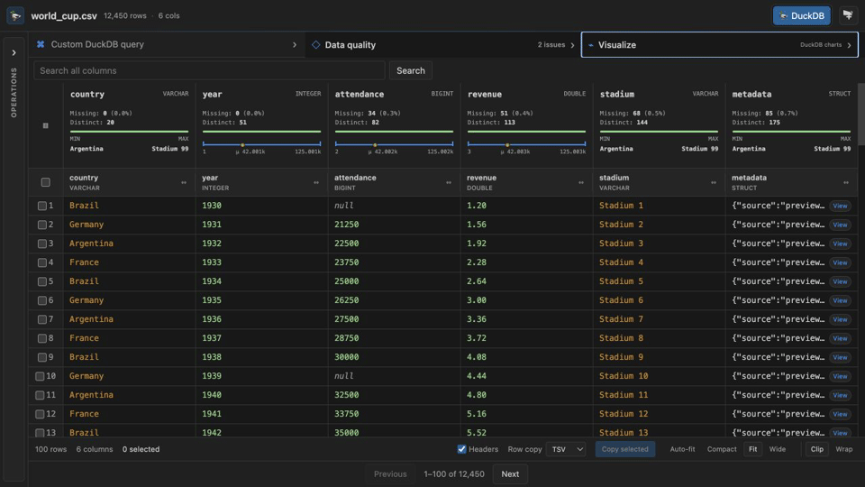
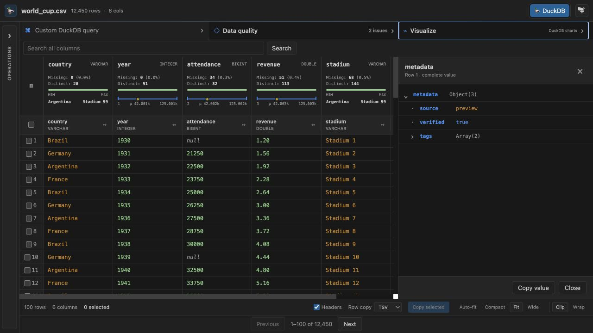

# QuackWrangler

<p align="center">
  
</p>

[](https://github.com/mohsinsurani/quackwrangler/actions/workflows/ci.yml)
[](https://marketplace.visualstudio.com/items?itemName=quackwrangler.quackwrangler)
[](LICENSE)
[](https://code.visualstudio.com/)

**Open, clean, explore, and export data without leaving VS Code. Your files stay on your machine.**

QuackWrangler does not upload rows or cell values. If you choose to use the optional AI transform planner, it sends only your instruction, table schema, and a redacted visual-transform history. Values, expressions, file paths, and literals are removed before the request. It shows the proposed steps before changing anything.

QuackWrangler ships with DuckDB built in. Open CSV, Parquet, JSON, Excel, and ODS files directly—no Python environment, Jupyter kernel, or database setup required.

> QuackWrangler is an independent open-source project inspired by the visual workflow of data-wrangling tools.

**Install:** `code --install-extension quackwrangler.quackwrangler`

<figure>



<figcaption>Open world_cup.csv → inspect column profiles → browse nested structs → visualize correlations — all without leaving VS Code.</figcaption>

</figure>



## Fast workflows

- **Quick filter:** right-click a table cell to keep its value, exclude it, find matching text, or show nulls. The result is a normal undoable transform.
- **Formula Builder:** open **Transform → Formula Builder** to create conditional columns, date differences, regex extractions, or combined text without SQL.
- **Join or append files:** open **Combine Files**, choose another supported file, then configure a join or append rows by matching column names.
- **Save an analysis:** run **QuackWrangler: Save Workspace** from the Command Palette to create a portable `.qw` file. Use **QuackWrangler: Open Workspace** to restore its source and transform history.
- **Recent files:** the QuackWrangler activity-bar view keeps the ten most recently opened data files.
- **Work with nested data:** select a struct, list, map, or JSON cell to browse it as a tree, copy a JSON Pointer, extract a field, flatten an object, or explode an array into rows.
- **Open cloud data:** run **QuackWrangler: Open Remote HTTPS/S3 Data** to query a supported remote file through DuckDB `httpfs`.
- **Visible remote loading:** HTTPS/S3 opens show staged progress and surface actionable connection, authentication, and format errors in the editor.
- **Generate a cleaning plan:** store an AI provider key in VS Code SecretStorage, then use **AI plan**. Only your instruction, schema metadata, and redacted visual-transform history are sent; generated steps require approval and pass the normal transform validator.
- **Compare schemas:** select multiple files with **Compare File Schemas**, or recursively inspect up to 100 files with **Detect Folder Schema Drift**.

## What's new in 0.2.0

- Open Parquet, CSV, and XLSX directly in the QuackWrangler custom editor, with independent state for every open tab.
- Use the more visible **AI plan** action with OpenAI or an HTTPS OpenAI-compatible Responses API; stale and overlapping plans are safely discarded.
- Load small local sources eagerly and large or remote sources lazily, with configurable thresholds, DuckDB threads, and insertion-order behavior.
- Keep custom SQL, charts, profiles, exports, and Command Palette actions scoped to the correct editor even when asynchronous responses arrive late.
- Export the active custom-query result, use reliable row selection and Select All, and retain the previous dataset if a refresh or source promotion fails.
- Target dbt export at the focused editor and reject local-file or raw-expression transforms that cannot produce portable dbt SQL.

## Why QuackWrangler?

| Workflow                    | QuackWrangler      | Typical file viewer | Python notebook workflow |
| --------------------------- | ------------------ | ------------------- | ------------------------ |
| Open local data immediately | Built-in DuckDB    | Usually             | Environment dependent    |
| Visual transformations      | Yes                | Usually read-only   | Code required            |
| Column profiles and charts  | Yes                | Limited             | Code required            |
| Custom analytical queries   | DuckDB SQL         | Rare                | Yes                      |
| Python or kernel required   | **No**             | No                  | **Yes**                  |
| Export transformed results  | Parquet, CSV, JSON | Limited             | Code required            |

QuackWrangler sits between a basic file preview and a full notebook. It gives you a quick visual workflow for everyday data work, while keeping each change reproducible.

## Performance benchmark

On a deterministic one-million-row Parquet workload, QuackWrangler's production Node DuckDB engine completed the analytical transform faster than both comparison engines. Polars loaded the file faster and had the lowest end-to-end time; QuackWrangler finished the complete workflow about 1.7× faster than Pandas.

| Engine                           | Load Parquet | Filter + aggregate + sort |        Total |
| -------------------------------- | -----------: | ------------------------: | -----------: |
| QuackWrangler (DuckDB 1.5.6-r.1) |     21.36 ms |               **8.18 ms** |     29.68 ms |
| Polars 1.43.1                    |  **5.69 ms** |                  21.48 ms | **26.24 ms** |
| Pandas 3.0.5                     |     11.25 ms |                  39.72 ms |     50.69 ms |

These are medians of seven measured runs after two warmups on an Apple M3 Pro with 18 GB RAM, recorded October 4, 2026. Every engine ran equivalent eager operations and returned the same validated 20-row result. Lower is better.

### Scaling and peak memory

Fresh-process measurements include each language runtime and its loaded libraries:

| Rows | QuackWrangler time / RSS |     Polars time / RSS |    Pandas time / RSS |
| ---: | -----------------------: | --------------------: | -------------------: |
|  10K |          5.76 ms / 97 MB |  **4.79 ms** / 133 MB |    75.84 ms / 126 MB |
| 100K |    27.58 ms / **102 MB** |  **6.82 ms** / 146 MB |    52.17 ms / 143 MB |
|   1M |    44.66 ms / **171 MB** | **34.84 ms** / 308 MB |   105.54 ms / 324 MB |
|  10M |   **320.88 ms / 740 MB** | 559.61 ms / 1,224 MB | 787.46 ms / 1,627 MB |

At 10 million rows, QuackWrangler was 1.7× faster than Polars and 2.5× faster than Pandas in this workload, while its measured peak process RSS was 40% lower than Polars and 54% lower than Pandas. All engines completed successfully; no unmeasured OOM claim is made. See the [raw scalability results](benchmarks/results/scalability.json).

```text
10M rows — total workflow time (lower is better)

QuackWrangler  321 ms  ██████████
Polars         560 ms  █████████████████
Pandas         787 ms  ████████████████████████
```

An exploratory single 50M-row run also completed for every engine:

| Engine        |      Total | Peak process RSS |
| ------------- | ---------: | ---------------: |
| QuackWrangler | **1.18 s** |      **2.29 GB** |
| Polars        |     2.73 s |          3.82 GB |
| Pandas        |     4.54 s |          4.92 GB |

This 50M result is one fresh-process sample rather than a multi-run median. System swap usage increased during the experiment, so it is published as exploratory evidence and not used for an OOM or “under 1 GB” claim. See the [raw 50M result](benchmarks/results/scalability-50m.json).

### File-format loading

For the same generated 100K-row dataset, DuckDB materialized Parquet in 20.04 ms, NDJSON in 59.99 ms, and CSV in 77.13 ms. Parquet was 3.8× faster to load than CSV and produced a much smaller file. See the [raw format results](benchmarks/results/formats.json).

This is a reproducible workload, not a universal engine ranking; results depend on hardware, versions, data shape, cache state, swap pressure, and query. Peak RSS is more defensible than an allocator delta but still includes different runtime overheads. Large runs remain opt-in because they can materially affect workstation responsiveness.

See the [benchmark methodology and run instructions](benchmarks/README.md) and [raw machine-readable result](benchmarks/results/latest.json). Re-run it locally with:

```bash
npm run benchmark
npm run benchmark:all # primary, scalability, and format suites
```

## Highlights

- DuckDB-native execution with automatic disk spilling
- **No Python, Jupyter, or database setup required** — works immediately
- Local-first privacy: file contents, rows, and cell values are processed on your machine and are never sent to external servers
- Virtualized grid with synchronized headers and consistent column sizing
- Professional column profiles with completeness, cardinality, ranges, percentiles, and distributions
- Inline histogram, bar, scatter, line, box-plot, and correlation-heatmap charts backed by full DuckDB queries
- Data-quality summary for nulls, duplicates, and potential IQR outliers
- Expandable nested-data tree for structs, lists, maps, and JSON values, with JSON Pointer copying and extract/flatten/explode transforms
- Parquet, CSV, TSV, JSON, JSONL/NDJSON, XLSX, and ODS viewing
- Filters, sorting, deduplication, column rename/drop/add/cast, null filling, and grouping/aggregation
- Full-dataset search across every column (`Cmd/Ctrl+F`)
- Pivot and unpivot reshaping
- Drag-and-drop transformation ordering
- Custom read-only DuckDB SQL with results shown in the grid
- Multi-row selection and spreadsheet-friendly TSV, CSV, pipe, or JSON copying
- Full transformed-data export to Parquet, CSV, or JSON
- Undo and redo for the transformation pipeline, with `Cmd/Ctrl+Z`, `Cmd+Shift+Z`, and `Ctrl+Y` shortcuts
- Visual IF/date/regex/text formula builder
- Multi-file joins and union-by-name
- Shareable `.qw` workspaces and recent-file shortcuts
- HTTPS/S3 sources, schema comparison/drift reports, and opt-in schema-only AI transform plans
- Contextual dbt project detection with copyable model SQL and CTE snippets

### Why DuckDB is the default engine

The extension currently uses DuckDB because it can run analytical queries larger than the configured memory limit by spilling intermediate data to disk. An eager Polars DataFrame normally materializes its working data in RAM, which can use more memory on large files. Polars also has a streaming engine and can be very efficient, so this is not a claim that DuckDB always uses less memory; it describes QuackWrangler's current workload and the measured results above.

## Install

### From the VS Code Marketplace

Open Extensions in VS Code, search for **QuackWrangler**, and select **Install**. You can also open the [Marketplace listing](https://marketplace.visualstudio.com/items?itemName=quackwrangler.quackwrangler). The command-line equivalent is:

```bash
code --install-extension quackwrangler.quackwrangler
```

Marketplace releases use separate native packages for Windows, Linux, Alpine Linux, Intel/Apple Silicon macOS, and x64/ARM64 systems. VS Code selects the matching package automatically from the single QuackWrangler listing.

### From a local VSIX

```bash
git clone https://github.com/mohsinsurani/quackwrangler.git
cd quackwrangler
npm ci
npm --prefix webview-ui ci
npm run package
code --install-extension quackwrangler-<platform>-<version>.vsix
```

Alternatively, run **Extensions: Install from VSIX...** from the VS Code Command Palette and select the generated file.

## Use QuackWrangler

1. Open QuackWrangler from the Activity Bar.
2. Choose **Open data file** for one file, or **Open data folder** to scan a directory.
3. The folder view preserves subdirectories, hides unsupported files and empty folders, and opens a data file when selected.
4. You can also right-click a supported file in Explorer and choose **Open in QuackWrangler**.
5. Clicking a Parquet, CSV, or XLSX file opens the QuackWrangler visual editor by default. Other supported formats remain available through **Open in QuackWrangler** without replacing their normal VS Code editor association.
6. Inspect column profiles and values in the synchronized data grid.
7. Expand the labelled **Operations** rail, select an operation, enter its parameters, and apply it. Press `Enter` to apply an open form or `Escape` to close it.
8. Use `Cmd/Ctrl+Z` to undo and `Cmd+Shift+Z` or `Ctrl+Y` to redo; the toolbar actions are enabled only when the corresponding history action is available.
9. Use **AI plan** to describe a goal and preview a validated visual transform plan, or use **Custom DuckDB query** to run one read-only `SELECT`, `WITH`, or `VALUES` statement.
10. Export the complete transformed dataset, or the active custom-query result when the query view is open. You can also select rows and copy them as TSV, CSV, pipe-separated text, or JSON.

Custom queries run against `current_data`, which is scoped to the current editor's transformed pipeline:

```sql
SELECT country, COUNT(*) AS matches
FROM current_data
WHERE year >= 2000
GROUP BY country
ORDER BY matches DESC;
```

Mutation statements are rejected because the query box is an exploration surface, not an unrestricted database console.

## Filters and transforms

Filters support equality and inequality, `>`, `>=`, `<`, `<=`, contains, does not contain, starts with, ends with, `IN`, `NOT IN`, null checks, and range checks. Values are safely converted for numeric, boolean, date/time, and text columns.

Other operations include:

| Category        | Operations                                                                                    |
| --------------- | --------------------------------------------------------------------------------------------- |
| Filter          | Typed filters, cell quick filters, search, remove duplicates                                  |
| Transform       | Add, formula-build, rename, drop, cast, fill nulls, and extract/flatten/explode nested values |
| Arrange         | Header sorting or explicit ascending/descending sort                                          |
| Aggregate       | Group and aggregate, pivot, and unpivot                                                       |
| Combine files   | Left/inner/right/full join and union-by-name                                                  |
| Explore         | Type-aware profiles, data-quality findings, charts, nested-value inspector, read-only SQL     |
| Export and copy | Parquet, CSV, JSON, clipboard formats, selected rows                                          |

QuackWrangler only offers numeric aggregations such as average for compatible scalar columns. Nested JSON values remain inspectable without being sent to invalid DuckDB aggregate functions. Click a nested cell to open its tree. Node actions can copy an RFC 6901-style JSON Pointer, extract the selected value as a column, flatten a selected object, or explode a selected array into rows. These actions become ordinary pipeline steps, so they support undo, redo, reordering, and `.qw` workspace persistence.

## Supported file formats

| Format         | Extensions                   | Notes                                                |
| -------------- | ---------------------------- | ---------------------------------------------------- |
| Parquet        | `.parquet`                   | Native DuckDB reader                                 |
| Delimited text | `.csv`, `.tsv`               | Automatic schema and delimiter detection             |
| JSON           | `.json`, `.jsonl`, `.ndjson` | Arrays, records, and nested values supported         |
| Excel          | `.xlsx`                      | Uses DuckDB's spreadsheet support                    |
| OpenDocument   | `.ods`                       | Uses DuckDB's spreadsheet support                    |
| Arrow IPC      | `.arrow`, `.arrows`, `.ipc`  | Uses DuckDB's signed `nanoarrow` community extension |

HTTPS and S3 URLs are supported for formats handled by the corresponding DuckDB reader. Remote access uses DuckDB `httpfs`; private S3 authentication follows DuckDB/AWS credential-chain configuration, so QuackWrangler does not place cloud credentials in workspace files.

ORC files are detected and produce an actionable compatibility message, but they are not advertised as readable: the embedded DuckDB 1.5 runtime does not currently expose a supported ORC reader. Convert ORC to Parquet or CSV before opening it. QuackWrangler will enable native ORC loading only when a supported, testable DuckDB reader is available.

Spreadsheet support can require DuckDB to download an extension the first time it is used. Legacy `.xls` files are not currently supported.

### Troubleshooting file loading

If a file does not open, choose **View → Output** and select **QuackWrangler** from the channel menu. The log records the source path, whether the failure occurred while connecting to DuckDB, preparing a format reader, loading data, or building the preview, and the native error stack. This is particularly useful for first-time XLSX/ODS/Arrow opens, which may need to download a DuckDB extension.

For extension activation failures that happen before the QuackWrangler channel appears, run **Developer: Show Logs…** from the Command Palette and open **Extension Host**, or choose **Help → Toggle Developer Tools** and inspect the Console. Include the QuackWrangler version, operating system, CPU architecture, the failing file type, and the relevant error block when reporting a problem; review paths and data values before sharing logs publicly.

## AI privacy and configuration

AI transform generation is disabled until you explicitly store an API key using **QuackWrangler: Configure AI Provider API Key**. The key is kept in VS Code SecretStorage, never settings or `.qw` files. Use the labelled **AI plan** action in an open data editor or the Command Palette to describe a goal. Requests contain your instruction, schema metadata, and redacted visual-transform history only—no rows, cell values, samples, file paths, expressions, or literals. The proposed plan is shown for approval, cannot contain raw SQL, and is strictly validated against the same operations available in the visual UI. OpenAI is the default provider; an HTTPS OpenAI-compatible Responses API can be selected with `quackwrangler.ai.provider` and `quackwrangler.ai.baseUrl`.

When an opened local file is inside a workspace containing an ancestor `dbt_project.yml`, QuackWrangler reveals **Copy as dbt SQL** in the editor toolbar and Command Palette. It can copy a complete dbt model query or reusable CTEs built from the active validated transform history. QuackWrangler asks for the upstream model used by `ref()` and does not parse or modify the dbt project. Generated expressions retain DuckDB SQL semantics; review adapter compatibility when the dbt target is not DuckDB.

## Settings

Open VS Code Settings and search for `QuackWrangler`, or configure values directly:

```json
{
  "quackwrangler.duckdb.memoryLimit": "1GB",
  "quackwrangler.duckdb.tempDirectory": "",
  "quackwrangler.duckdb.maxTempDirectorySize": "15GB",
  "quackwrangler.duckdb.loadingMode": "auto",
  "quackwrangler.duckdb.eagerFileSizeLimitMb": 64,
  "quackwrangler.duckdb.threads": 0,
  "quackwrangler.duckdb.preserveInsertionOrder": true,
  "quackwrangler.display.pageSize": 100,
  "quackwrangler.display.maxRows": 10000,
  "quackwrangler.ai.provider": "openai",
  "quackwrangler.ai.model": "gpt-4o-mini",
  "quackwrangler.ai.baseUrl": "",
  "quackwrangler.ai.timeoutSeconds": 60
}
```

When `duckdb.tempDirectory` is empty, spill files use a unique directory under VS Code's extension storage and are removed when QuackWrangler shuts down. A configured directory is created if needed and is never automatically deleted.

Automatic loading materializes local files up to `duckdb.eagerFileSizeLimitMb` and keeps larger or remote sources lazy through a DuckDB view. Set `duckdb.loadingMode` to `eager` or `lazy` to override that choice. A `duckdb.threads` value of `0` leaves thread selection to DuckDB. Source row order is preserved by default for stable unsorted previews; disable `duckdb.preserveInsertionOrder` to reduce memory use on large data.

## Develop locally

Requirements: Node.js 20 or newer, npm 10 or newer, and VS Code 1.85 or newer. Python is not required. Install `uv` only when running the optional Polars/Pandas benchmarks.

```bash
git clone https://github.com/mohsinsurani/quackwrangler.git
cd quackwrangler
npm ci
npm --prefix webview-ui ci
code .
```

In VS Code, open **Run and Debug**, select **Run QuackWrangler Extension**, and press `F5`. A new **Extension Development Host** window opens. Open a folder with data in that window and use **Open in QuackWrangler** from the file context menu.

Useful commands:

```bash
npm run build          # type-check and build the extension and webview
npm test               # unit and integration tests
npm run test:vscode    # isolated VS Code Extension Host lifecycle tests
npm run test:coverage  # coverage report
npm run lint           # static checks
npm run watch          # rebuild the extension while developing
npm run benchmark      # compare DuckDB, Polars, and Pandas locally
npm run benchmark:all  # primary, scalability, and file-format suites
npm run package        # production build and VSIX package
```

Before a release, follow the [complete QA checklist](docs/QA_CHECKLIST.md), including the Extension Development Host smoke tests that exercise VS Code APIs.

Python, Polars, and Pandas are not extension runtime dependencies. Benchmark scripts use isolated `uv` environments.

## Maintainers

Marketplace releases are maintainer-controlled. See [Release and Marketplace publishing](docs/RELEASING.md) for the private-credential, QA, packaging, and publishing workflow.

## Contributing

See [CONTRIBUTING.md](CONTRIBUTING.md). Bug reports and pull requests are welcome at [github.com/mohsinsurani/quackwrangler](https://github.com/mohsinsurani/quackwrangler).

- Ask questions and share ideas in [GitHub Discussions](https://github.com/mohsinsurani/quackwrangler/discussions).
- Browse [good first issues](https://github.com/mohsinsurani/quackwrangler/labels/good%20first%20issue) if you are new to the project.
- Read the [Code of Conduct](CODE_OF_CONDUCT.md) before participating.
- Report security issues privately by following the [Security Policy](SECURITY.md); do not open a public issue for a suspected vulnerability.
- See [CHANGELOG.md](CHANGELOG.md) for versioned release notes.

## License

Copyright (c) 2026 QuackWrangler Contributors. Released under the [MIT License](LICENSE), which permits private and commercial use, modification, distribution, and sublicensing subject to preserving the license notice.
